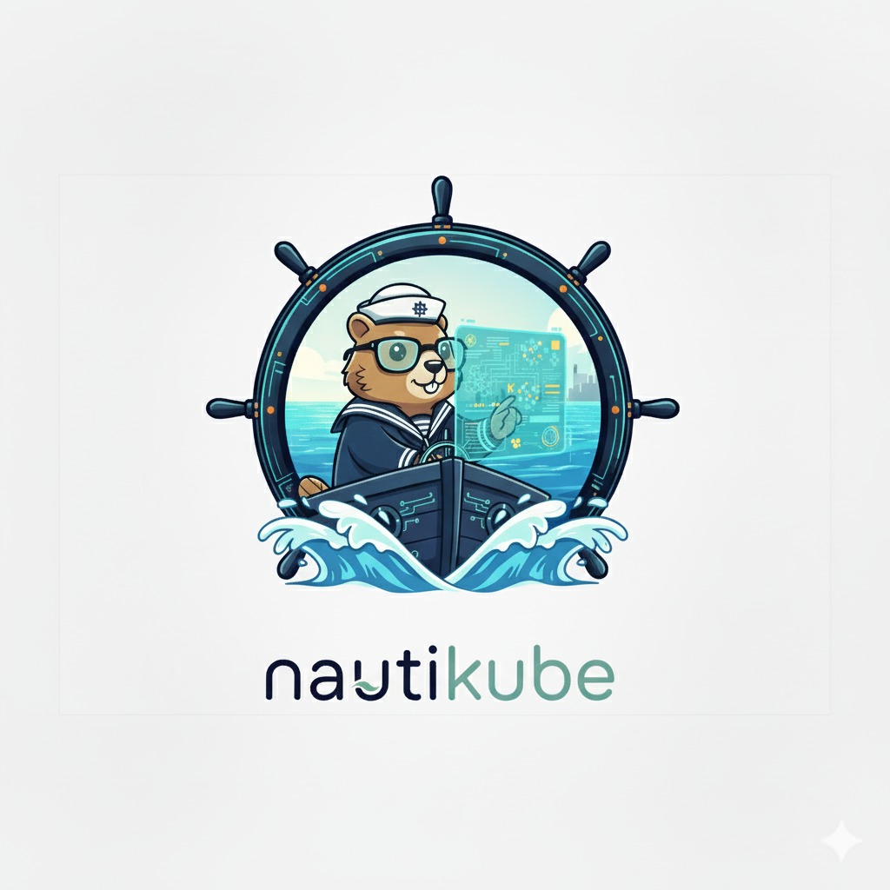

<p align="center">
  
</p>

<h1 align="center">NautiKube</h1>

<p align="center">
  <strong>Kubernetes Cluster Diagnostic CLI — Detect, Prioritize, Remediate</strong>
</p>

<p align="center">
  <a href="https://github.com/jorgegabrielti/nautikube/actions/workflows/ci.yml"></a>
  <a href="https://github.com/jorgegabrielti/nautikube/releases/latest"></a>
  <a href="https://goreportcard.com/report/github.com/jorgegabrielti/nautikube"></a>
  <a href="https://codecov.io/gh/jorgegabrielti/nautikube"></a>
  <a href="LICENSE"></a>
</p>

---

NautiKube scans your live Kubernetes cluster, **identifies and prioritizes problems with a 0–100 score**, and provides ready-to-use `kubectl` remediation commands. Zero external dependencies beyond the cluster itself — no AI, no cloud services, no Docker required.

## Key Features

| Feature | Description |
|---|---|
| **Live Cluster Analysis** | Scans Pods, Deployments, Services, Nodes, and Warning Events in real time |
| **Score-Based Prioritization** | Every problem gets a 0–100 score based on severity and context |
| **Actionable Remediation** | Embedded knowledge base with copy-paste `kubectl` commands |
| **Multiple Output Formats** | Colorized table, JSON, and YAML for both humans and automation |
| **Single Binary** | No runtime dependencies — just download and run |
| **Minimal Footprint** | Read-only Kubernetes API calls, zero writes to your cluster |

## Quick Comparison

| | Popeye | kube-score | **NautiKube** |
|---|---|---|---|
| Analysis target | Live cluster | Static YAML | **Live cluster** |
| Prioritization | ❌ Flat list | ❌ Pass/fail | ✅ **Score 0–100** |
| Remediation | ❌ Problem only | ❌ Problem only | ✅ **kubectl commands** |
| Output formats | Table/JSON | Table/JSON/SARIF | **Table/JSON/YAML** |

## Installation

### From Releases (recommended)

Download the latest binary for your platform from the [Releases page](https://github.com/jorgegabrielti/nautikube/releases/latest).

```bash
# Linux (amd64)
curl -sL https://github.com/jorgegabrielti/nautikube/releases/latest/download/nautikube_linux_amd64.tar.gz | tar xz
sudo mv nautikube /usr/local/bin/

# macOS (Apple Silicon)
curl -sL https://github.com/jorgegabrielti/nautikube/releases/latest/download/nautikube_darwin_arm64.tar.gz | tar xz
sudo mv nautikube /usr/local/bin/
```

### From Source

```bash
go install github.com/jorgegabrielti/nautikube/cmd/nautikube@latest
```

### Build Locally

```bash
git clone https://github.com/jorgegabrielti/nautikube.git
cd nautikube
make build
```

## Usage

```bash
# Scan all namespaces (default: colorized table)
nautikube scan

# Scan a specific namespace
nautikube scan -n production

# Filter by resource type
nautikube scan -r Pod,Deployment

# Filter by positional resource args
nautikube scan Pod Deployment Node

# Show only high severity and above
nautikube scan -s high

# Export results to JSON (format auto-detected from extension)
nautikube scan -f report.json

# Export results to YAML or CSV
nautikube scan -f report.yaml
nautikube scan -f report.csv

# Disable colors (CI-friendly)
nautikube scan --no-color

# Custom kubeconfig and context
nautikube scan --kubeconfig ~/.kube/staging --context staging

# Show version
nautikube version
```

## What It Detects

### Pods
- `CrashLoopBackOff` — containers stuck in restart loops
- `ImagePullBackOff` / `ErrImagePull` — broken image references
- `OOMKilled` — containers exceeding memory limits
- Pending pods — unschedulable due to resource constraints
- High restart counts — threshold-based severity (5 → low, 20 → medium, 50+ → high)
- Unready containers — readiness probe failures

### Deployments
- Unavailable replicas — pods not reaching Ready state
- Replica mismatches — desired vs. actual drift
- Stuck rollouts — deployments unable to progress

### Services
- No endpoints — services with zero backing pods
- Pending LoadBalancer — external IP never assigned
- ExternalName without target — missing DNS reference

### Nodes
- NotReady — nodes unable to run workloads
- Memory / Disk / PID pressure — resource exhaustion
- Cordoned / Unschedulable — maintenance-drained nodes

### Events
- High-frequency Warning events — aggregated by source and reason

## Architecture

```
cmd/nautikube/
└── main.go                    → Entry point (~15 lines)

internal/
├── cli/                       → Cobra commands (root, scan, version)
├── k8s/                       → Kubernetes client factory (functional options)
├── scanner/                   → Scanner interface + 25 implementations (one per resource type)
├── diagnosis/                 → Problem types, scoring, embedded knowledge base
└── output/                    → Formatter interface (table, JSON, YAML)
```

### Design Principles

- **Accept interfaces, return structs** — `Scanner` and `Formatter` interfaces
- **Functional options** — `k8s.NewClient(k8s.WithKubeconfig(...))`
- **Table-driven tests** — pure stdlib `testing` package, no testify
- **`//go:embed`** — knowledge base compiled into the binary
- **`context.Context` as first param** — all I/O functions
- **Minimal dependencies** — only cobra, color, yaml.v3, and client-go

## Development

### Prerequisites

- Go 1.22+
- [golangci-lint](https://golangci-lint.run/) (optional, for linting)
- [govulncheck](https://pkg.go.dev/golang.org/x/vuln/cmd/govulncheck) (optional, for vuln scanning)

### Quality Gate

```bash
make check       # Run all gates: fmt → vet → lint → vuln → test → build
```

### Individual Targets

```bash
make fmt          # Check formatting
make fix          # Auto-fix formatting + lint
make vet          # Run go vet
make lint         # Run golangci-lint
make vuln         # Check for known CVEs
make test         # Unit tests with race detector
make integration  # Integration tests (requires live cluster)
make coverage     # HTML coverage report
make build        # Build binary with version injection
make clean        # Remove build artifacts
```

## Contributing

See [CONTRIBUTING.md](CONTRIBUTING.md) for guidelines.

## License

[MIT](LICENSE) — see the [LICENSE](LICENSE) file for details.
